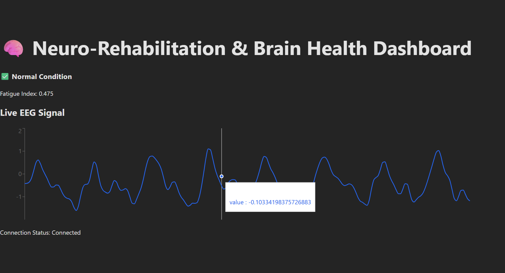

# Remote Neuro-Muscular Anomaly Detection and Cognitive Fatigue Monitoring using Machine Learning and Web Technologies

## Objective
To develop a prototype web-based system that can detect early signs of **cognitive fatigue** and **neuro-muscular anomalies** from **EEG** and **EMG** signals using machine learning algorithms, and present the results through a **real-time, interactive dashboard** for both patients and clinicians.

## Problem Statement
Neurological disorders and mental fatigue often go unnoticed until severe symptoms appear, due to the lack of accessible, real-time monitoring tools. Traditional neuro-rehabilitation systems are either too costly, limited to hospital settings, or non-interactive.  
There is a critical need for an **affordable, scalable system** that can monitor a person’s brain and muscle activity remotely and provide **early alerts** for anomalies or fatigue states.

## Proposed Solution
This project proposes a **modular and scalable** system that processes EEG and EMG biosignals using machine learning models for anomaly detection. The processed data and insights are visualized on a **user-friendly web interface** accessible to clinicians and users for continuous monitoring.

## System Components

### 1. Signal Input
- **Initially:** Simulated EEG and EMG time-series datasets.  
- **Future Scope:** Real-time input from devices like **OpenBCI**, **Emotiv**, or **Muse**.

### 2. Backend (FastAPI)
- Signal preprocessing (noise filtering, normalization).  
- Feature extraction (RMS, Band Power, Peak-to-Peak, etc.).  
- ML model for anomaly detection (Isolation Forest, Threshold-based detection).  
- REST API endpoints for frontend integration.

### 3. Frontend (ReactJS)
- Real-time charts for signal visualization.  
- Display of fatigue scores, anomaly alerts, and session summaries.  
- Role-based access (patient, doctor).

### 4. Database (MongoDB & PostgreSQL)
- Storage of user profiles, session data, and detected anomalies.

### Real-Time EEG/EMG Monitoring Dashboard

