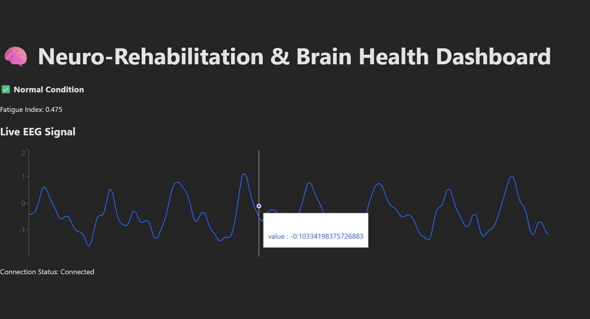

# 🧠 Remote Neuro-Rehabilitation & Brain Health Monitoring

A real-time web-based system for monitoring **cognitive fatigue** and **neuro-muscular anomalies** using EEG/EMG signals, Machine Learning, and modern web technologies.

The system is designed to provide an interactive monitoring platform for users and clinicians, with real-time signal visualization, anomaly detection, fatigue analysis, and session monitoring.

---

## 🎯 Problem Statement

Cognitive fatigue and neuro-muscular abnormalities can be difficult to monitor continuously outside clinical environments.

Traditional neuro-rehabilitation systems can be expensive, difficult to access remotely, and often lack real-time interactive monitoring.

This project explores a scalable software-based approach for processing biosignals and providing early indications of abnormal activity through a web interface.

---

## 💡 Key Features

* 📊 Real-time EEG/EMG signal visualization
* 🧠 Machine Learning-based anomaly detection
* 😴 Cognitive fatigue monitoring
* 📈 Signal preprocessing and feature extraction
* ⚡ Real-time communication using WebSockets
* 🔌 REST APIs for application integration
* 👨‍⚕️ Patient and clinician-oriented dashboards
* 🗄️ Database-backed session and monitoring data
* 🧩 Modular backend architecture

---

## 🏗️ System Architecture

```text
                    EEG / EMG Data
                          │
                          ▼
                ┌───────────────────┐
                │ Signal Processing │
                │ Filtering         │
                │ Normalization     │
                └─────────┬─────────┘
                          │
                          ▼
                ┌───────────────────┐
                │ Feature Extraction│
                │ RMS               │
                │ Band Power        │
                │ Peak-to-Peak      │
                └─────────┬─────────┘
                          │
                          ▼
                ┌───────────────────┐
                │ Machine Learning  │
                │ Anomaly Detection │
                │ Isolation Forest  │
                └─────────┬─────────┘
                          │
                          ▼
                ┌───────────────────┐
                │   FastAPI Backend │
                │ REST + WebSocket  │
                └─────────┬─────────┘
                          │
                    ┌─────┴─────┐
                    ▼           ▼
              React Frontend  Database
                    │
                    ▼
             Monitoring Dashboard
```

---

## 🛠️ Technology Stack

### Backend

* Python
* FastAPI
* REST APIs
* WebSockets

### Frontend

* React
* JavaScript
* HTML
* CSS

### Machine Learning

* Scikit-learn
* Isolation Forest
* Anomaly Detection
* Signal Feature Extraction

### Database

* MongoDB
* PostgreSQL

### Development Tools

* Git
* GitHub
* VS Code
* Jupyter Notebook

---

## 🔬 Signal Processing

The system currently works with simulated EEG and EMG time-series data.

The processing pipeline includes:

1. Signal acquisition
2. Noise filtering
3. Normalization
4. Feature extraction
5. Machine Learning-based anomaly detection
6. Result generation
7. Real-time dashboard visualization

Example extracted features include:

* RMS
* Band Power
* Peak-to-Peak amplitude
* Statistical signal characteristics

---

## 🤖 Machine Learning

The current prototype uses **Isolation Forest** for unsupervised anomaly detection.

The model identifies signal patterns that differ significantly from the expected baseline.

The architecture is designed so that additional models can be integrated in the future for:

* Cognitive fatigue classification
* Personalized baseline detection
* Neuro-muscular abnormality classification
* Time-series analysis

---

## ⚡ Real-Time Communication

The backend uses **WebSockets** to provide real-time communication between the FastAPI server and the React dashboard.

This allows monitoring data and detected events to be transmitted without repeatedly refreshing the application.

```text
Signal → Processing → ML Model → FastAPI → WebSocket → React Dashboard
```

---

## 📊 Dashboard

The dashboard provides a visual representation of monitored signals and detected events.



---

## 📁 Project Structure

```text
Remote-Neuro-Rehabilitation-Brain-Health-Monitoring/
│
├── backend/
│   ├── API/
│   ├── models/
│   ├── processing/
│   └── ...
│
├── frontend/
│   ├── src/
│   └── ...
│
├── Documentation/
│   └── image/
│
├── datasets/
│
└── README.md
```

> Project structure may evolve as development continues.

---

## 🚀 Future Improvements

The project is currently a prototype and can be extended with:

* Real EEG/EMG hardware integration
* OpenBCI / Emotiv / Muse device support
* Personalized user baselines
* Improved fatigue classification models
* Deep Learning-based time-series models
* Authentication and authorization
* Cloud deployment
* Advanced clinician analytics
* Secure medical-data handling
* Automated alerts for detected anomalies

---

## 🎓 Project Focus

This project combines:

**Machine Learning + Biosignal Processing + Backend Development + Real-Time Web Technologies**

The primary goal is to explore how AI and software engineering can be combined to build accessible remote monitoring systems.

---

## 👨‍💻 Author

**Somya Ranjan Kabi**

Computer Science Engineer interested in:

* Python Development
* Backend Engineering
* Machine Learning
* Artificial Intelligence
* Real-Time Applications

---

⭐ If you find this project interesting, feel free to explore the repository.


### Real-Time EEG/EMG Monitoring Dashboard


